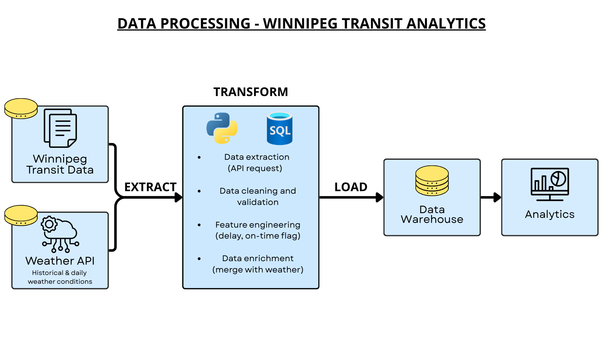

# Winnipeg Transit & Weather — ETL Pipeline

Data engineering project that builds a relational dataset by integrating public transit performance data from the City of Winnipeg Open Data Portal with historical weather observations from the Open-Meteo API.

---

## Overview

This project implements a full ETL workflow:

**Extract**
- Download transit on-time performance records (Winnipeg Open Data)
- Request historical weather data through a REST API (Open-Meteo)

**Transform**
- Data cleaning and standardization using Pandas
- Handling missing values and invalid records
- Feature engineering (on-time performance rate, precipitation indicators)
- Deduplication and aggregation of operational records

**Load**
- Load cleaned data into a relational database
- Populate staging tables, dimension tables, and a fact table
- Enforce primary and foreign key relationships

---

## Pipeline Architecture

  

---

## Database & Normalization

The database was modeled following dimensional modeling principles and normalized to approximately **Third Normal Form (3NF)**:

- Staging tables for raw ingestion
- Dimension tables (date, route, destination, time period)
- Fact table storing transit performance metrics
- Removal of redundant attributes
- Referential integrity enforced via foreign keys

---

## Tech Stack

- **Python** (pandas, requests)
- **Jupyter Notebook**
- **MySQL**
- **Git & GitHub**

---

## Key Skills Demonstrated

- REST API data extraction
- Data wrangling with Pandas
- Handling inconsistent real-world datasets
- Relational database design
- Data normalization (3NF)
- SQL data loading and transformations
- Version control with Git
